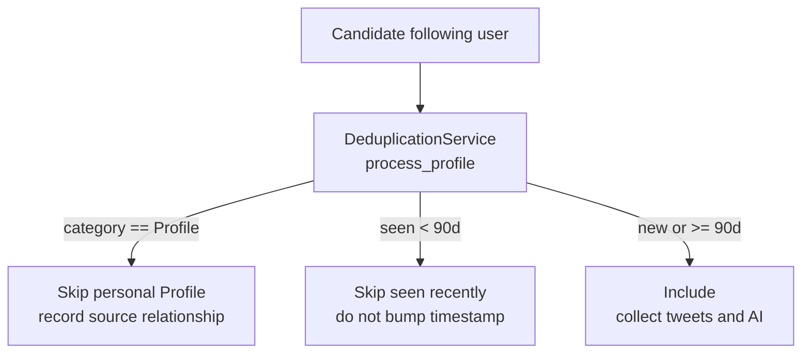
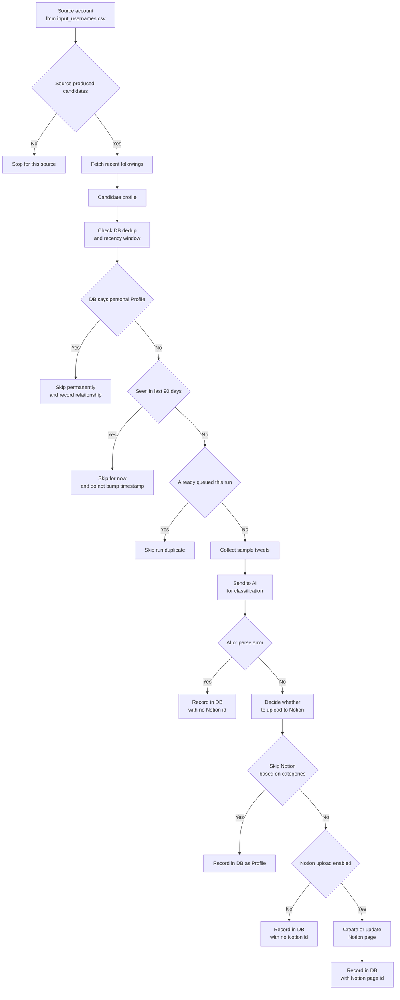

# Twitter Following Discovery + AI Triage (Architecture)

This project watches a set of “source” X/Twitter accounts, detects when they follow new accounts, collects a small tweet sample for those newly-followed accounts, runs an LLM classification step, and (optionally) uploads the results to a Notion database. A SQLite DB is used to deduplicate profiles globally using a recency window (default: 90 days): recently-processed accounts are skipped, older accounts can be re-processed, and accounts classified as personal `Profile` are permanently skipped.

## Key Inputs / Outputs

- **Input**: `input_usernames.csv` (columns: `screen_name,user_id`)
- **Primary outputs**
  - `follower_tweets/*_tweets.json`: profile + extracted tweet text for each included discovered account
  - `follower_tweets/ai_tweets/*_ai_input.json` + `*_ai_response.json`: what was sent to OpenAI + the parsed response
  - `follower_counts/follower_counts_*.csv`: last-known “following” counts per source account (used for change detection)
  - `db/twitter_profiles.db`: global “processed profiles” + discovery source relationships (dedup + tracking)
  - `raw_api_responses/*.json`: raw Twitter API responses for debugging

## High-Level Flow

```mermaid
flowchart TB
  CSV[input_usernames.csv<br>screen_name and user_id]
  ENV[.env + config.py]

  subgraph Main["main.py"]
    MAIN[main()]
    COUNTS[get_following_counts()]
    PREV[get_previous_follower_count()]
    PROC[process_username()]
    FILTER[Dedup and recency filter<br>90 days]
    COLLECT[collect_tweets_for_new_followers()]
    AI[analyze_tweets_with_ai()]
  end

  subgraph External["External services"]
    RAPID[RapidAPI Twitter endpoints\nUsersByRestIds / FollowingLight / UserTweets]
    OPENAI[OpenAI Chat Completions]
    NOTION[Notion Database API]
    S3[S3 (optional)]
  end

  subgraph Storage["Local storage"]
    DB[(SQLite: db/twitter_profiles.db)]
    COUNTSCSV[(follower_counts/*.csv)]
    RAW[(raw_api_responses/*.json)]
    TWEETS[(follower_tweets/*_tweets.json)]
    AIIO[(follower_tweets/ai_tweets/*.json)]
  end

  CSV --> MAIN
  ENV --> MAIN

  MAIN --> COUNTS --> RAPID
  MAIN --> PREV --> COUNTSCSV

  MAIN --> PROC --> RAPID
  PROC --> FILTER
  FILTER <--> DB
  FILTER -->|included| COLLECT --> RAPID
  COLLECT --> RAW
  COLLECT --> TWEETS --> AI --> OPENAI
  AI -->|skip / error| DB
  AI -->|upload| NOTION --> DB

  MAIN --> COUNTSCSV
  MAIN -->|optional sync| S3
  S3 <--> DB
```

## Major Steps (What `main.py` Does)

1. **Boot + setup**
   - Loads environment/config (`config.py`) and ensures directories exist.
   - Optional S3 sync: downloads a newer `db/twitter_profiles.db` and latest follower counts before processing.
   - Optional recovery: if `recovery_state.json` exists, skips already-processed tweet files.

2. **Initialize Notion categories**
   - Fetches existing Notion “Category” options and injects them into the LLM prompt (replaces `{categories}` in `prompts/tweet_analysis_prompt.txt`).

3. **Read seed/source accounts**
   - Reads `input_usernames.csv` and limits to `MAX_PROFILES`.

4. **Fetch current following counts (per source)**
   - Batch calls RapidAPI `UsersByRestIds` and builds a map: `screen_name -> friends_count`.

5. **Detect “new following” events**
   - For each source account:
     - Loads the previous count from the newest `follower_counts/follower_counts_*.csv`.
     - If the source is new (no previous count): **baseline only** (no followings processed).
     - If `count_diff == 0`: skip (no processing).
     - Otherwise: fetches the most recent followings using RapidAPI `FollowingLight` with `fetch_count = count_diff` (or `3` if `count_diff <= 0`).

6. **Filter discovered accounts (DB-backed dedup + recency window)** (detailed below)
   - Only the accounts that pass this filter become “work items” for tweet collection + AI processing.
   - Existing profiles skipped due to the recency window do not have `last_updated_date` bumped (so they can “age out” and be re-processed later).
   - `main()` also suppresses duplicates within a single run (`seen_handles` / `batch_seen`) before tweet collection.

7. **Collect tweets for included accounts**
   - For each included discovered account:
     - Calls `UserTweets(count=5)`, extracts tweet text; if empty or a retryable error occurs, falls back to `UserTweetsAndReplies(count=5)`.
     - Writes `follower_tweets/{screen_name}_tweets.json` with `{ profile, tweets, sourceUsername }`.
     - Writes raw responses to `raw_api_responses/` for debugging.

8. **AI analysis + Notion upload triage**
   - Sorts tweet files by “complexity” (size + text length) to reduce token risk.
   - For each tweet file:
     - Builds an LLM prompt from `prompts/tweet_analysis_prompt.txt` (with live Notion categories inserted).
     - Calls OpenAI with a strict “JSON object” response format.
     - **Skips Notion upload** if categories are `["Profile"]` only, or if meme/NFT categories are present; still records the handle in the dedup DB with `notion_page_id=None`.
     - Otherwise uploads a page to Notion and records `notion_page_id` in the dedup DB.

9. **Persist counts + summarize**
   - Writes a new dated follower counts CSV.
   - Logs run summary and skip breakdown (AI-triage skips).
   - Optional S3 sync: uploads the updated DB + newest follower counts file.

## Detailed Filtering: Dedup + Recency Window (90 days)

This is the primary gate for deciding which discovered accounts turn into tweet collection + AI analysis work.

### Where this happens

- `process_username()` calls `DeduplicationService.process_profile()` for each candidate returned by RapidAPI `FollowingLight`.
- `main()` additionally suppresses duplicates within a single run using `seen_handles` (cross-source) and `batch_seen` (within a single source batch).

### Step 0: “Is this source eligible to produce work?”

- If the source account is **new** (no previous `follower_counts_*.csv` entry): it returns “Baseline” and produces **no work items**.
- If the source’s following count **did not change** (`count_diff == 0`): produces **no work items**.
- If followings cannot be fetched (e.g., protected / not authorized): produces **no work items**.

Only sources with a nonzero diff proceed to fetch and filter recent followings.

### Step 1: Global dedup + recency window (DB-backed)

For each candidate account returned by `FollowingLight`, `DeduplicationService.process_profile()` checks `db/twitter_profiles.db`:

- If the saved `category == "Profile"`: **always skip** (personal profiles are permanently excluded), but the source relationship is still recorded.
- Otherwise:
  - If the account age is under **1 year** and the profile already exists in the DB: **skip** and do not recheck for pivot yet.
  - If `last_updated_date` is within the last **90 days**: **skip** and **do not bump** `last_updated_date` (so it can age out).
  - If `last_updated_date` is older than **90 days** (or missing/unparseable): treat as **eligible again** and allow it through for re-processing.

### Step 2: In-run duplicate suppression

Because newly-included handles are only written to the DB after AI triage, the same handle can appear multiple times in a single run (across sources or within a batch). `main()` prevents duplicate tweet collection by skipping:

- Handles already queued earlier in the run (`seen_handles`)
- Duplicates within the same source’s “new followings” list (`batch_seen`)

### What happens on include vs skip

- **Included** → tweet collection writes `follower_tweets/{handle}_tweets.json`, then AI analysis runs:
  - If AI triage decides **skip Notion** (Profile-only or meme/NFT categories): `record_new_profile(... category="Profile", notion_page_id=None ...)`
  - If AI triage decides **upload/update Notion**: `record_new_profile(... category="Project", notion_page_id=... ...)`
  - If AI/Notion processing errors: it still records the handle (with `notion_page_id=None`) to avoid infinite retry loops.
- **Skipped by dedup/recency** → no tweet file is written and `last_updated_date` is not changed.

### Dedup/recency decision diagram



### Note on configuration vs implementation

The recency window is currently hard-coded as `90` days in `services/deduplication_service.py`. If you want it configurable, wire it to `config.py` and use it in both the dedup check and the “stale Notion update” reporting.

## End-to-End Flow Diagram Twitter to AI to Notion


